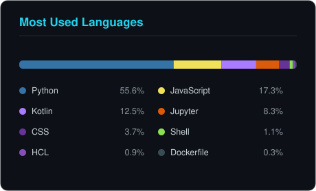

<div align="center">


<a href="https://github.com/official-eswaran">
  
</a>

<br/>

**Building private-by-default AI systems that run on your machine — not someone else's server.**

<br/>


<a href="https://github.com/official-eswaran?tab=followers"></a>
<a href="https://github.com/official-eswaran?tab=repositories"></a>

<br/><br/>

<a href="mailto:official.eswaranj@gmail.com"></a>
<a href="https://github.com/official-eswaran/DataWhisper"></a>

</div>

<div align="center">

```
─────────────────────────────────────────────────────────────────
```

</div>

## About Me

I build **local-first AI applications** — systems where the intelligence runs next to the data instead of leaving the building.

My main project, **[DataWhisper](https://github.com/official-eswaran/DataWhisper)**, started as a natural-language-to-SQL assistant and grew into a multi-tenant SaaS platform: FastAPI backend, React 19 frontend, DuckDB execution engine, and a local Ollama LLM — with Stripe billing, per-tenant quotas, a tamper-evident audit hash chain, Kubernetes manifests, and Terraform infrastructure behind it. I also write Kotlin: **[Smart Auto App Organizer](https://github.com/official-eswaran/smart-auto-app-organizer)** is an Android launcher that classifies apps entirely on-device with a Naive Bayes model I implemented from scratch, plus a rule engine and TFLite fallback.

- 🔭 **Currently building** — hardening DataWhisper toward real production traffic: end-to-end tests, an NL-to-SQL accuracy eval, and a verified Stripe money path
- 🧠 **Currently learning** — distributed systems correctness, evaluation-driven LLM development, and Kubernetes operations at small scale
- ⚡ **What I enjoy** — Python and FastAPI, type-safe Kotlin, SQL engines, and infrastructure that is reproducible from a single command
- 🎯 **Goal** — ship software that survives contact with real users, real money, and real load
- 🌱 **Where I started** — a RAG PDF Q&A app in 2025, classical ML notebooks, then full systems

<div align="center">

```
─────────────────────────────────────────────────────────────────
```

</div>

## Tech Stack

<details open>
<summary><b>Languages</b></summary>
<br/>


</details>

<details open>
<summary><b>Backend</b></summary>
<br/>


</details>

<details open>
<summary><b>Frontend & Mobile</b></summary>
<br/>


</details>

<details open>
<summary><b>AI / ML & Data Science</b></summary>
<br/>


</details>

<details open>
<summary><b>Databases & Storage</b></summary>
<br/>


</details>

<details open>
<summary><b>Cloud, DevOps & Observability</b></summary>
<br/>


-232F3E?style=flat-square&logo=amazonwebservices&logoColor=white)


</details>

<details open>
<summary><b>Testing & Quality</b></summary>
<br/>


</details>

<details open>
<summary><b>Tools & Environment</b></summary>
<br/>


</details>

<div align="center">

```
─────────────────────────────────────────────────────────────────
```

</div>

## Featured Projects

<table>
<tr>
<td width="50%" valign="top">

### 🔐 [DataWhisper](https://github.com/official-eswaran/DataWhisper)

**Private AI data assistant — natural language to SQL with zero data leakage.**

Upload a CSV, Excel, JSON or Parquet file, ask a question in plain English, and get back a table, a chart, or a number. Every part of the pipeline runs locally: no API keys, no cloud LLM, nothing leaves the machine.

**Key engineering:**
- NL→SQL pipeline: intent classifier → schema mapper → prompt builder → Ollama → SQL validator → DuckDB → result formatter, streamed over SSE
- Self-healing SQL — failed queries are auto-corrected and retried
- Multi-tenant SaaS layer: orgs, per-plan quotas, usage metering, Stripe Checkout + webhooks
- Tamper-evident audit hash chain with signed checkpoints (O(1) verification instead of a linear scan)
- Auth hardening: rotating refresh tokens in httpOnly cookies, bcrypt (rounds=12), account lockout, rate limiting
- Ships with Kubernetes manifests (HPA 2–10, PDB, health-gated rollout, migration Job) and Terraform for RDS/ElastiCache/S3
- CI gate: ruff + pytest coverage threshold + pip-audit + npm audit + Trivy image scanning

`Python 3.12` `FastAPI` `React 19` `Vite` `DuckDB` `Postgres` `Redis` `Ollama` `Stripe` `Docker` `Kubernetes` `Terraform` `OpenTelemetry`

> **Why it matters:** it is not a notebook wrapped in Streamlit — it is a system with migrations, tenancy, billing, observability, a disaster-recovery runbook, and a public backlog of its own unresolved P0s.

</td>
<td width="50%" valign="top">

### 📱 [Smart Auto App Organizer](https://github.com/official-eswaran/smart-auto-app-organizer)

**Android launcher that auto-organizes your apps with on-device AI.**

Scans installed apps, classifies them (Games, Payments, Social, Shopping…) and builds folders dynamically — fully offline, no network calls, no telemetry.

**Key engineering:**
- Hybrid classifier: rule engine + a Naive Bayes model written from scratch in Kotlin + TFLite inference path, gated on a confidence threshold
- Custom text vectorizer and training corpus, both in-repo
- Clean architecture — `data / domain / ui` layers, MVVM, Hilt DI, Room, WorkManager for background classification
- Jetpack Compose UI with drag-and-drop, folder PIN lock, and Material theming (light + dark)
- Broadcast receiver re-classifies on every new install
- Unit-tested rule engine (JUnit)

`Kotlin` `Jetpack Compose` `MVVM` `Hilt` `Room` `WorkManager` `Coroutines/Flow` `TensorFlow Lite`

> **Why it matters:** ML that ships to a device, with the accuracy/latency trade-offs handled explicitly instead of hidden behind an API call.

</td>
</tr>
<tr>
<td width="50%" valign="top">

### 📄 [Pdf-Responder](https://github.com/official-eswaran/Pdf-Responder)

**RAG-powered Q&A over multiple PDFs.**

Extracts and chunks PDF text, embeds it with Google Generative AI embeddings, indexes it in a FAISS vector store, and answers questions through a Gemini 1.5 Flash chain — with an explicit "answer is not available in the context" guard against hallucination.

**Key engineering:**
- `RecursiveCharacterTextSplitter` chunking with overlap for retrieval quality
- Persisted FAISS index (build once, query many)
- Custom prompt template that refuses to answer outside the retrieved context
- Streamlit interface for multi-document upload

`Python` `LangChain` `Google Gemini` `FAISS` `PyPDF2` `Streamlit`

> **Why it matters:** my first end-to-end retrieval system — the groundwork for the grounded, refuse-when-unsure behaviour in DataWhisper.

</td>
<td width="50%" valign="top">

### 🤖 [Machine-Learning](https://github.com/official-eswaran/Machine-Learning)

**Classical ML, built from scratch and documented properly.**

A growing collection of supervised-learning projects with reproducible notebooks, saved models, and per-project write-ups.

**Currently includes — SONAR Mine vs Rock:**
- Binary classification of 208 sonar returns across 60 signal-energy features
- Stratified train/test split, logistic regression, honest reporting: **83.4% train / 76.2% test accuracy**
- Full workflow documented: EDA → split → train → evaluate → predict on new input
- Serialized model (`.pkl`) checked in for reuse

`Python` `scikit-learn` `Pandas` `NumPy` `Jupyter`

> **Why it matters:** the accuracy numbers are reported as measured, including the train/test gap — no rounding up.

</td>
</tr>
</table>

<div align="center">

```
─────────────────────────────────────────────────────────────────
```

</div>

## GitHub Statistics

<div align="center">

<!-- Self-hosted cards: generated by scripts/generate_cards.py, refreshed daily by
     .github/workflows/stats.yml. The usual third-party widget services were
     returning 503 / 402 on this profile, so these are built from the GitHub API
     and committed here instead. -->



<br/><br/>


<br/><br/>


<br/><br/>

<!-- Snake animation — generated by .github/workflows/snake.yml -->


</div>

<div align="center">

```
─────────────────────────────────────────────────────────────────
```

</div>

## Developer Journey

```text
2025 · JUL  ──  Joined GitHub. First commits, first repos.

2025 · AUG  ──  Pdf-Responder — RAG over PDFs with LangChain, Gemini,
                FAISS and Streamlit. First retrieval pipeline end to end.

2026 · FEB  ──  Machine-Learning — classical ML from scratch:
                SONAR mine-vs-rock classification, documented and versioned.

2026 · FEB  ──  DataWhisper v1 — NL-to-SQL over local data with Ollama:
                intent classification, chart recommendation engine,
                SSE token streaming, PWA, HTTPS on LAN, audit logging.

2026 · FEB  ──  Smart Auto App Organizer — Kotlin/Compose Android launcher
                with an on-device hybrid classifier (rules + Naive Bayes + TFLite).

2026 · JUL  ──  DataWhisper → multi-tenant SaaS. In one sprint:
                Alembic migrations, 74-test backend suite, Docker/K8s/Terraform,
                backup + restore runbooks, Sentry + OpenTelemetry + Prometheus,
                per-tenant quotas, Stripe subscriptions, CRA→Vite migration,
                Playwright e2e, k6 load tests, httpOnly refresh-token auth,
                and an O(1) audit-chain verification scheme.
                6 pull requests merged · 30+ issues triaged P0/P1/P2.
```

<div align="center">

```
─────────────────────────────────────────────────────────────────
```

</div>

## Skills Matrix

| Skill | Level | Hands-on Since | Shipped In | Confidence |
|:--|:--|:--|:--|:--|
| **Python** | Advanced | 2025 | DataWhisper, Pdf-Responder, ML notebooks | ★★★★★ |
| **FastAPI / REST APIs** | Advanced | 2026 | DataWhisper (10 route modules, SSE streaming) | ★★★★★ |
| **SQL & DuckDB** | Advanced | 2026 | DataWhisper NL→SQL engine + validator | ★★★★☆ |
| **LLM Application Engineering** | Advanced | 2025 | DataWhisper, Pdf-Responder | ★★★★☆ |
| **Kotlin / Jetpack Compose** | Proficient | 2026 | Smart Auto App Organizer | ★★★★☆ |
| **React / Vite frontend** | Proficient | 2026 | DataWhisper dashboard, admin console, charts | ★★★★☆ |
| **Docker & docker-compose** | Proficient | 2026 | DataWhisper full-stack compose + images | ★★★★☆ |
| **Testing (pytest, Playwright, k6)** | Proficient | 2026 | 74-test backend suite, e2e smoke, load tests | ★★★★☆ |
| **CI/CD (GitHub Actions)** | Proficient | 2026 | Lint + coverage gate + audit + Trivy pipeline | ★★★★☆ |
| **Auth & AppSec** | Proficient | 2026 | JWT rotation, bcrypt, lockout, audit hash chain | ★★★★☆ |
| **Classical ML (scikit-learn)** | Working | 2026 | SONAR classifier, Naive Bayes in Kotlin | ★★★☆☆ |
| **Kubernetes** | Working | 2026 | DataWhisper manifests (HPA, PDB, probes, Jobs) | ★★★☆☆ |
| **Terraform / IaC** | Working | 2026 | RDS + ElastiCache + S3 modules | ★★★☆☆ |
| **Observability (OTel, Prometheus)** | Working | 2026 | DataWhisper tracing + `/metrics` | ★★★☆☆ |

<sub>Levels reflect what is visible in these repositories — not years on a résumé.</sub>

<div align="center">

```
─────────────────────────────────────────────────────────────────
```

</div>

## Current Focus

<table>
<tr>
<td width="25%" valign="top"><b>🔨 Building</b><br/><br/>Taking DataWhisper from "works on my machine" to "runs in production" — real Stripe transactions, real load, real uptime.</td>
<td width="25%" valign="top"><b>📚 Learning</b><br/><br/>Evaluation-driven LLM development, Kubernetes operations, and correctness under concurrency.</td>
<td width="25%" valign="top"><b>🧭 Interested In</b><br/><br/>Local-first and privacy-preserving AI, query engines, on-device inference, developer tooling.</td>
<td width="25%" valign="top"><b>🎯 Next</b><br/><br/>An NL-to-SQL accuracy benchmark, a public DataWhisper deployment, and more entries in the ML series.</td>
</tr>
</table>

<div align="center">

```
─────────────────────────────────────────────────────────────────
```

</div>

## Open Source

I develop in the open: work is tracked as issues, delivered through pull requests, and reviewed before merge — even on solo projects.

- **30+ issues** filed and triaged by severity (P0 → P2) on DataWhisper, including the ones that are inconvenient to admit: *"NL2SQL correctness is unmeasured"*, *"No production hours — nothing has run outside a dev machine"*
- **6 pull requests** merged from feature branches — multi-tenancy, observability, object storage, frontend migration, billing, load testing
- **MIT licensed** where I want people to reuse the code
- Every merged change lands behind a CI gate that lints, tests, checks coverage, and scans dependencies and images

**Open to:** collaboration on local-first AI tooling, hackathons, applied-ML research, and issues on any of my repositories. If something here is useful to you and broken for you, open an issue — I'll read it.

<div align="center">

```
─────────────────────────────────────────────────────────────────
```

</div>

## Coding Philosophy

```python
class HowIBuild:
    """The rules my repositories actually follow."""

    def principles(self) -> list[str]:
        return [
            "Privacy is architecture, not a setting — if data can stay local, it stays local.",
            "A feature isn't done until it has a migration, a test, and a way to observe it.",
            "Write the honest issue. 'This has never run in production' is a P0, not a footnote.",
            "Fail loudly in production, never silently degrade.",
            "Measure before claiming — report the test accuracy, not the training accuracy.",
            "Small, reviewable pull requests over heroic commits.",
        ]

    def definition_of_done(self) -> bool:
        return all([self.tested, self.documented, self.reproducible, self.observable])
```

<div align="center">

```
─────────────────────────────────────────────────────────────────
```

</div>

## Contact

<div align="center">

<a href="https://github.com/official-eswaran"></a>
<a href="mailto:official.eswaranj@gmail.com"></a>

<br/><br/>

**Open to opportunities in backend, full-stack, and applied AI engineering.**

<br/>

> *"Simplicity is prerequisite for reliability."*
> — **Edsger W. Dijkstra**

<br/>


</div>

<!-- profile README -->
